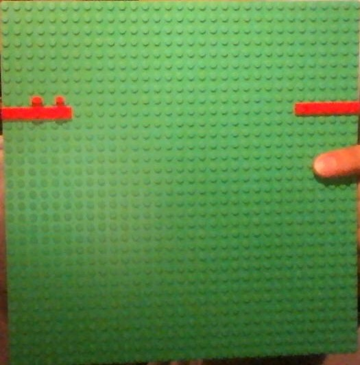

```sh

============================================  
=  ______           _                 _    =  
=  | ___ \         | |               | |   =  
=  | |_/ /_ __ __ _| |__  _ __ __ _  | |   =  
=  | ___ \ '__/ _` | '_ \| '__/ _` | | |   =  
=  | |_/ / | | (_| | |_) | | | (_| | |_|   =  
=  \____/|_|  \__,_|_.__/|_|  \__,_| (_)   =  
=                                          =  
============================================  
```


#	Brabra !
This augmented reality project was initially developed for the course
CS-211 "Introduction to visual computing" given in 2014-2015 at EPFL.

###### Featuring:
- Processing 3, Java 8, JavaFX and ready for Scala
- 3D interactive physic simulation
- A starship shooting missiles
- Dynamic scene initialization
- Image analysis for quad detection (bugged for now)

*For developers, see also the [readmeDev](dev/readmeDev.md), [todo](dev/todo.md) and [todoJavaFX](dev/todoJavaFX.md) files.*

<br>

# 1.	Real Game
The key interface of the project :D

It display the view of the scene from a camera. The scene contains all the simulated objects. 

- `q`, `r`	=>  restart the game
- `<tab>`	   	=>  change the camera mode

<br>

#### Scene
The existing objects are separated in 4 main category (Just an object is standalone too): 
- Camera
- Body
- Effect
- Weaponry, weapons

#### Camera
The camera is an object that carry the camera in the scene.
It can work in several modes and follow a particular object (focused).

- **fixed**: look at zero.
- **static**: look at the location of the focused.
- **relative**: look from the parent perspective (follow his rotation too).

Each mode has his own distance from the focused (looked) point.

press `<tab>` to change the camera mode.

<br>

#### Focused object/body
You can focus your interaction on an object or body. 

- `e`       	=>  shoot the biggest ready missile (if available)
- `w`, `s` =>  go forward / backward
- `<alt>`		=>	brake
- `space`   	=>  unbrake (less brake)
- mouse drag, `a`, `d`
				=>  turn the object around
- scroll wheel 	=>  change the interaction force

<br>

#### Scene initialization
You will find an input file `Brabra/bin/input/scene.xml` to configure the initialization 
of the scene's objects and parameters: camera and physic(in settings). To reload the file, restart the game with `q` or `r`.

supported parameters: <i>**settings**: gravity, deltaTime. **camera**: displaySkybox, displayAxis, displayCentralPoint, [mode, dist]</i>

supported object names: ***object, movable, plane, ball, box, starship :rocket:, target***.

supported object attributes: ***pos, dir, parency, name, life, [color, (stroke)], [camera, (cameraDist)], [focus, (force)], displayCollider, debug***.

supported moving attributes: ***velocity, rotationVel***.

supported body attributes: ***size, mass, name, impluse, displayCollider***.

supported object names: ***floor, ball, box, starship, target***.

supported weaponry attributes: <i>**weaponry**: prefab, displayColliders, puissance. **weapon**: tier, upgradeRatio, puissanceRatio, displayColliders</i>

supported weapon names: ***missile_launcher***

file example with all supported attributes:
	
	<?xml version="1.0" encoding="UTF-8"?>
	<scene>
		<settings gravity="0.2" running="true" verbosity="max" displayAllColliders="false"></settings>
		
		<camera displaySkybox="true" mode="not" dist="(300,300,300)" debug="false">
			<!-- Family works with the camera too ! it's just a regular object. -->
			<box pos="(0,0,-400)" mass="0" color="yellow"></box>
		</camera>
		
		<floor pos="zero" color="grass"></floor> 
		
		<ball pos="(20,200,-300)" mass="5" color="red"></ball>
		
		<starship pos="(0,200,0)" focus="true" force="72" camera="static" debug="false" displayCollider="false">
			<!-- You can stack the children as wished :D -->
			<box pos="(40,0,-20)" name="pink box" mass="0" color="pink">
				<ball pos="(0,40,0)" name="upper ball" color="blue" mass="0"></ball>
			</box>
			
			<!-- The weapons automatically add themselves to the weaponry. -->
			<weaponry puissance="400" prefab="none" displayColliders="false">
				<missile_launcher pos="(30,-10,0)" tier="2" upgrade="1.2"></missile_launcher>
				<missile_launcher pos="(0,-15,0)" tier="3" upgrade="1.2"></missile_launcher>
				<missile_launcher pos="(-30,-10,0)" tier="2" upgrade="0.8" displayColliders="true"></missile_launcher>
			</weaponry>
		</starship>
		
		<!-- targets can be destroyed by missiles. -->
		<target pos="(-200,200,0)" life="50/200" color="red"></objectif>
		
	</scene>
	
<br>

# 2. 	Trivial Game
Initial excepted project for the course. Only reacts to the rotation of the detected plate.

<br>

# 3.	Image Analysis (not working atm)
#### Plate
The augmented reality aspect of this project remains in the possibility to control
the software with an external object. 
We want to detect a plate or quad with a particular colour (example: see "plate exemple.jpg"). Once calibrated, the software will compute the rotation of the plate relative of the camera.
In option, it also detects two buttons on each side of the plate.

- rotation       =>  turn the focused object around
- left button	 =>  go forward, brake if not visible
- right button   =>  shoot missiles bigger with the visibility

example plate:



<br>

#### Calibration
Here you can find and manage image filtering parameters to operate the image analysis.
It is mainly thresholding of the pixel colours in both RGB and HSV representation.

- `p` => pause/play the input
- `i` => change the input (camera / example video)
- `l` => load a parameters file
- `s` => save current parameters
- `b` => go in 'button detection' mode, to calibrate the button detection

<br>

#### Control screen
When image analysis is enabled and not paused, a control or feedback screen will be 
displayed in the upper left corner of the window reporting what the software sees.

- darker control screen => no quad detected
- quad in red => rotation of the plate is too big
			(max 65°, happens too when the quad is wrongly detected.)
- button circles are red => not enough detected to count

<br>

# 4. 	Contact, contributors

Maxime Hulliger, `hulliger@epfl.ch`

######Contributors

Mathieu Girard, `girarg@epfl.ch`

Boris, `boris@epfl.ch`

Max Turpenteim, `maxtu@kth.se`

Kei Wakabayashi `keiw@kth.se`